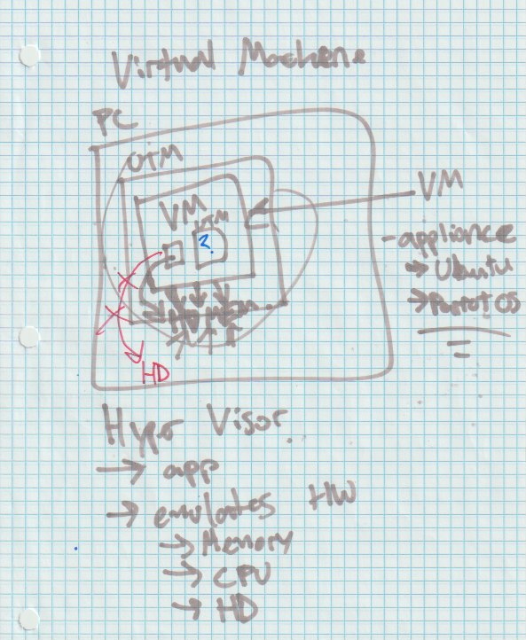
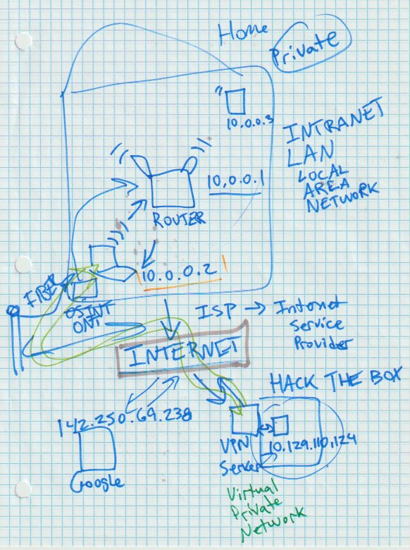

# Getting Started

General topics and info about hacking.

## Operating Systams and Virtual Machines

* Operating System (OS)
  * Mac OS X
  * Windows
  * Linux
    * Distributions
      * Ubuntu
        * Debian
      * Pop OS
      * Linux Mint
      * Red Hat Linux
      * Fedora
      * CentOS
      * Rocky
      * Arch
      * Suse
      * SlackWare
      * Knopix
      * Gentoo
      * Free BSD
      * Tails
      * Android
      * Pen Testing OS
        * Pre-installed with pen testing software
        * Kali Linux
        * Parrot OS
* Hyper Visor
  * An app that runs on the host machine
  * Virtualizes / Emulates Hardware for guest OS
  * Arm M1 Mac
    * UTM
  * Virtualbox
  * Hyper V
  * Vmware Player
  * qemu

### Containers

### Virtual Machines

### Private vs Public Networks

## Types of Hacking

* Penetration Testing (Pen Testing)
  * Red Team
    * Offensive Security
  * Blue Team
    * Defensive Security
  * White Hat Hacker
    * Hacking "professionally"
    * Legally employed to hack
  * Black Hat Hacker
    * Malicious intentions
  * Gray Hat Hacker 
  * Network / Computer
    * Scanning / Analyzing / Assessing a computer system
      * In order to identify  
        * vulnerabilities
          * old versions of software
            * unpatched
        * mis configurations
  * Physical
    * Test gates / locks
      * Lock Picking
    * Social engineering
      * Tailgating
* Bug Bounties
  * Companies will pay hackers that find vulnerabilities
* Responsible Disclosure
  * Disclose found vulnerabilities to companies before publishing
  * Give companies time to fix / patch before publishing
* CVE
  * Common Vulnerabilities and Exposures
    * Known / documented / reported vulnerabilities
* Zero Day Exploit
  * Unknown vulnerabilities
* Application Security
  * AppSec
